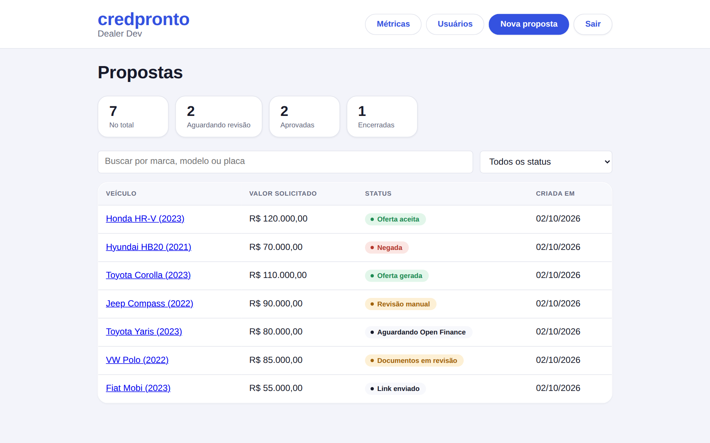
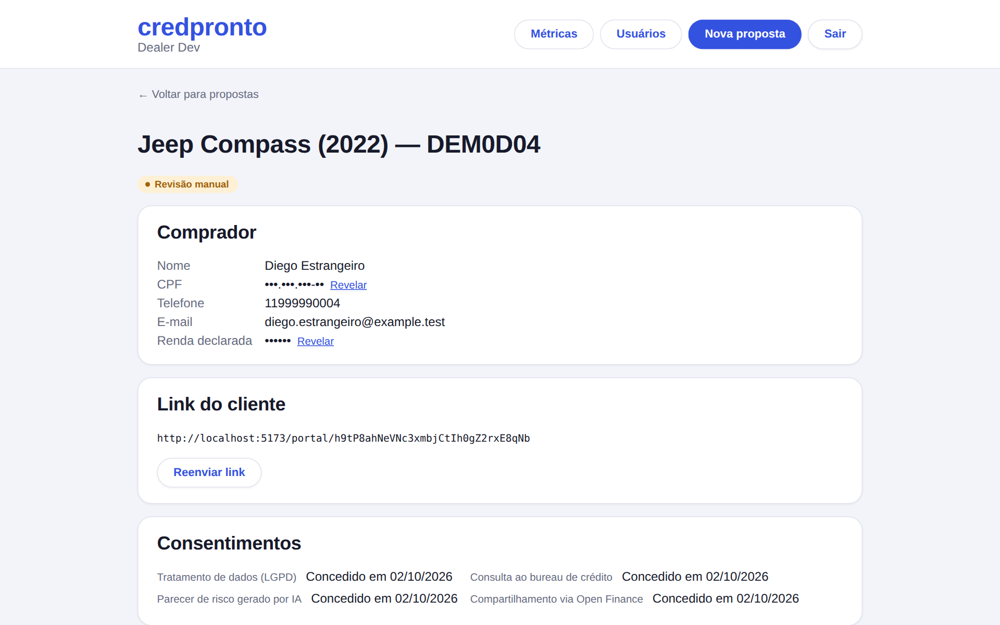

# credpronto


Esteira de análise de crédito para lojas de veículos: a loja cadastra uma proposta, o comprador
recebe um link próprio para completar seus dados e enviar documentos, o sistema roda uma
checagem de bureau simulada e um motor de decisão determinístico, e — se aprovado — gera uma
oferta de financiamento.

> **Projeto de portfólio.** Bureau de crédito (Serasa/SPC), restrição veicular e Open Finance
> Brasil são simulados — acesso real ao primeiro exige CNPJ e contrato comercial; ao segundo, não
> existe API pública no Brasil; ao terceiro, autorização do Banco Central (nem contrato resolve
> pra uma pessoa física). Todo dado usado em desenvolvimento e nas demos é sintético; nunca use
> CPF, nome ou documento reais neste projeto.

<p align="center">
  
  
</p>

<sub>Capturas do ambiente local com o seed de demonstração (`npm run db:seed`). Todos os dados são sintéticos.</sub>

## Duas frentes

- **Painel da loja** (`dealer.html`, `src/dealer/`) — autenticado, para o vendedor criar
  propostas, acompanhar a esteira e revisar casos.
- **Portal do cliente** (`client.html`, `src/client/`) — link único por proposta
  (`/portal/:token`), sem login, para o comprador preencher dados e enviar documentos.

## Rodando localmente

```bash
npm install
npm run db:seed    # cria dealer@credpronto.dev / credpronto123 + 7 propostas de exemplo
npm run dev
```

Sem nenhuma variável de ambiente definida, o backend roda contra um Postgres embutido (PGlite)
local — zero configuração. Acesse `http://localhost:5173/` para o painel da loja.

Pra zerar o banco local (descartável, nunca é usado em produção) e recomeçar só com o seed:

```bash
rm -rf .pglite-data .data
npm run db:seed
```

### Roteiro de demonstração

Depois do `npm run db:seed`, logue com `dealer@credpronto.dev` / `credpronto123` e a fila já vem
com 7 propostas em estados diferentes. O seed (`scripts/seed.ts`) não inventa números — ele chama
os mesmos mocks determinísticos e o mesmo motor de decisão (`decide()`) que a esteira real usa,
então cada resultado é uma consequência real da regra, não um valor fixo desconectado:

1. **Fiat Mobi — `link_sent`** — o ponto de partida: nada preenchido ainda. Copie o link do
   portal (`/portal/:token` na própria URL) e complete o fluxo do zero: dados pessoais (com os 3
   checkboxes de consentimento granular), upload de documento — inclui a opção "Passaporte
   (estrangeiros)" com número/país digitados junto com a foto —, Open Finance simulado,
   checagens, decisão, oferta. O indicador de progresso no topo do portal mostra em qual desses
   passos o cliente está. Como `link_sent` ainda é um status editável (Fase 14), a tela de
   detalhe também mostra "Editar proposta" — dá pra corrigir marca/modelo/placa/valores antes de
   o cliente sequer abrir o link.
2. **VW Polo — `documents_review_required`** — um RG com confiança baixa (58%) parado esperando
   revisão: os campos extraídos pela IA aparecem editáveis ao lado do número de documento que o
   próprio cliente digitou no envio, pra comparar. Clique em "Aprovar" ou "Rejeitar".
3. **Toyota Yaris — `awaiting_openfinance_consent`** — documento já aceito automaticamente,
   proposta parada esperando o cliente decidir sobre o Open Finance (ainda não existe
   consentimento nenhum registrado nesse ponto — só é criado quando o cliente responde).
4. **Jeep Compass — `manual_review`** — comprador estrangeiro com passaporte (número/país
   emissor digitados manualmente); o CPF que a IA "extraiu" diverge do declarado, o que o
   anti-fraude de verdade (`checkAntifraud`) pega como `cpf_mismatch` — e é esse sinal, não um
   outcome escolhido a dedo, que faz `decide()` forçar revisão manual.
5. **Toyota Corolla — `offer_created`** — o caminho feliz completo: valor FIPE **real** (consulta
   de verdade à BrasilAPI no momento do seed), Open Finance autorizado, decisão aprovada
   calculada pela regra real, oferta gerada com a mesma fórmula do endpoint de produção.
6. **Hyundai HB20 — `denied`** — placa com restrição de roubo/furto/gravame (simulada) — a regra
   que nega antes de qualquer outra coisa em `decide()`, mesmo com bureau limpo. Cliente autorizou
   só o tratamento de dados (não marcou bureau/parecer de IA) — mostra que a esteira segue
   funcionando com consentimento parcial.
7. **Honda HR-V — `offer_accepted`** — o ciclo inteiro concluído, incluindo a oferta aceita; é o
   caso mais "antigo" pra testar a janela longa de retenção (veja o item de crons abaixo).

Em qualquer uma delas: CPF e renda aparecem mascarados por padrão; clique em "Revelar" (usuário
seed é `admin`) e note a linha `pii.revealed` na "Trilha de auditoria", distinta das linhas
`pii.decrypted` rotineiras que a própria tela de detalhe já gera ao decriptar nome/telefone/e-mail.

Fora da fila:

- **"Nova proposta"** — antes de criar, digite marca/modelo/ano e clique em "Consultar valor
  FIPE" pra ver o valor de mercado real (BrasilAPI) já na hora de montar a proposta. Depois de
  criar, a seção "Notificações" no detalhe já mostra "Link do portal enviado ao cliente" —
  nenhuma das 7 propostas de exemplo tem isso por padrão (o seed insere direto nas tabelas, sem
  passar pelos gatilhos reais); "Reenviar link" adiciona uma segunda linha.
- **"Usuários"** (só aparece pro papel admin, que é o do login do seed) — criar/desativar/
  reativar outro usuário da loja e trocar seu papel, sem sair da UI.
- **"Métricas"** — taxa de aprovação, decisões por resultado e distribuição de score sobre as 7
  propostas de exemplo (4 delas já têm decisão real). "Tempo médio até a decisão" aparece como
  "—" com o banco recém-semeado — o seed não passa pelas transições reais, então nenhuma proposta
  de exemplo tem `decidedAt`; rode o roteiro de demonstração (item 1) até uma decisão de verdade
  pra ver esse número aparecer.
- **Crons manualmente**: `curl -X POST http://localhost:5173/api/cron/retention-sweep?dryRun=true`
  mostra o que seria anonimizado sem escrever nada; sem `dryRun`, anonimiza de verdade quem já
  passou da janela de retenção (nenhuma das 7 propostas de exemplo qualifica de cara — são
  recém-criadas, mas dá pra editar `updatedAt` direto no banco pra testar).

## Comandos

```bash
npm run dev              # servidor de dev (Vite + middleware que serve /api/*)
npm run build             # tsc -b && vite build → dist/
npm run typecheck         # tsc -b --noEmit
npm run lint               # eslint .
npm run format              # prettier --write .
npm test                    # vitest run
npm run test:coverage       # vitest run --coverage
npm run test:e2e              # playwright test — sobe seu próprio dev server (porta 5183) e
                               # semeia um banco isolado (.pglite-data-e2e), nunca toca no seu
npm run db:generate          # gera migração SQL a partir de api/_lib/schema.ts
npm run db:migrate            # aplica migrações (só necessário com DATABASE_URL real)
npm run db:seed                # cria o usuário dealer de desenvolvimento
```

## Arquitetura

Ver [CLAUDE.md](CLAUDE.md) para o racional completo de arquitetura, convenções herdadas do
[painel-do-ar](../painel-do-ar) e as limitações conhecidas e deliberadas do projeto.

## Estado do projeto

- ✅ Fase 0 — fundação (scaffolding, CI, dois portais)
- ✅ Fase 1 — esteira core com bureau e decisão simulados, sem IA e sem Open Finance
- ✅ Fase 2 — extração de documento via IA (Claude), com revisão manual do dealer
- ✅ Fase 3 — anti-fraude e consulta veicular (FIPE real via BrasilAPI + restrição simulada)
- ✅ Fase 4 — parecer de risco via IA (Claude), versão técnica e versão para o cliente
- ✅ Fase 5 — Open Finance Brasil simulado (integração real exige autorização do Bacen — ver CLAUDE.md)
- ✅ Fase 6 — hardening de LGPD (consentimento granular, mascaramento/revelação de PII, trilha de
  auditoria visível, retenção com anonimização, rate limiting) e polimento
- ✅ Fase 7 — layout compartilhado do dealer (corrige navegação que ficava sem saída)
- ✅ Fase 8 — upload de documento com dado manual + passaporte para comprador estrangeiro
- ✅ Fase 9 — consulta do valor FIPE já na criação da proposta
- ✅ Fase 10 — repaginação visual completa (tipografia, paleta, componentes)
- ✅ Fase 11 — revalidação geral ponta a ponta (ver CLAUDE.md para os achados registrados)
- ✅ Fase 12 — reenvio de link do cliente, paginação da fila, visibilidade de consentimento
- ✅ Fase 13 — feedback de erro nas ações do dealer, validação real de CPF na criação
- ✅ Fase 14 — edição de proposta em draft/link_sent/client_submitted
- ✅ Fase 15 — busca e filtro na fila de propostas
- ✅ Fase 16 — notificação simulada por e-mail
- ✅ Fase 17 — gestão de usuários da loja (admin)
- ✅ Fase 18 — dashboard de métricas
- ✅ Fase 19 — suíte de E2E formal (Playwright + CI)
